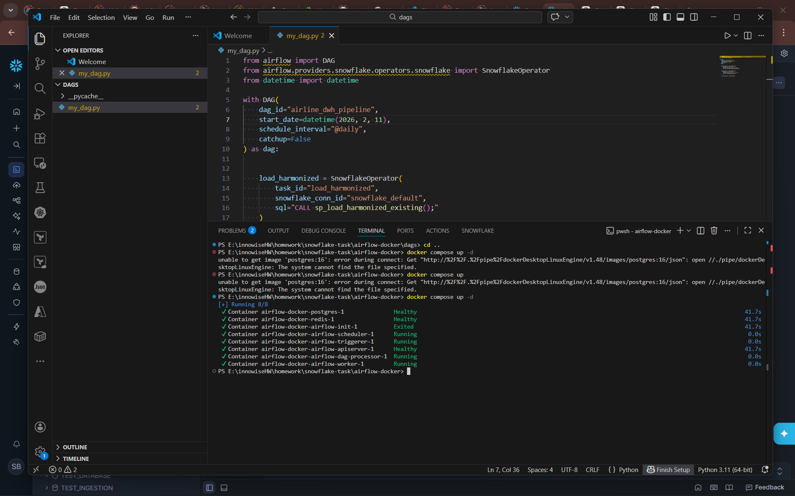
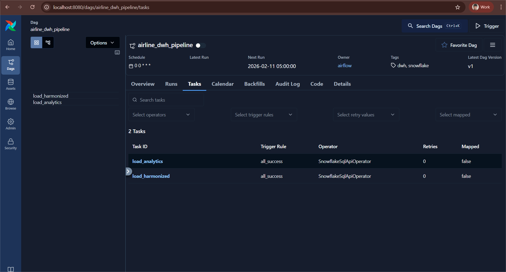
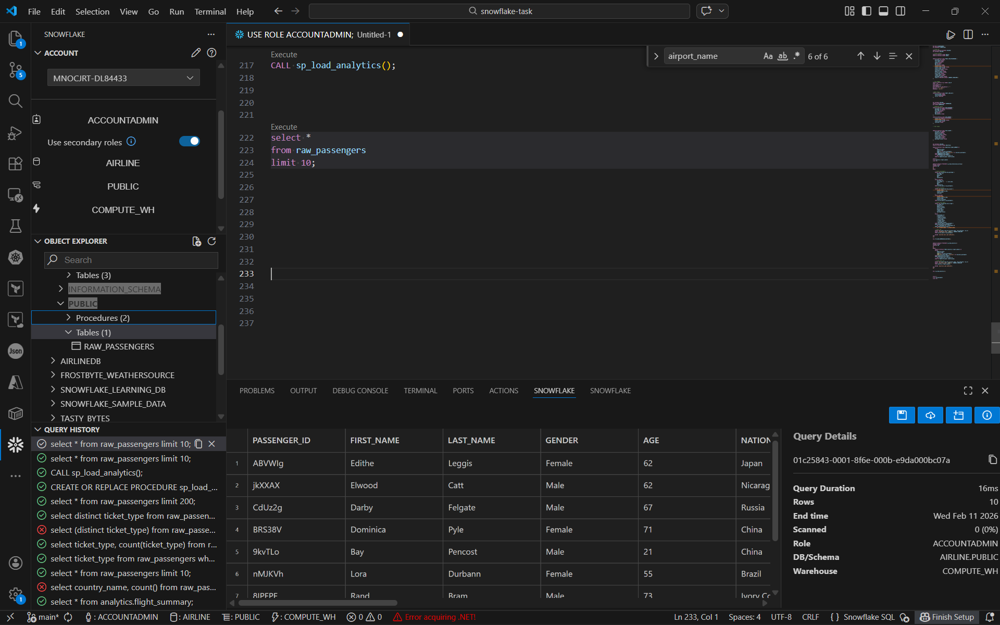
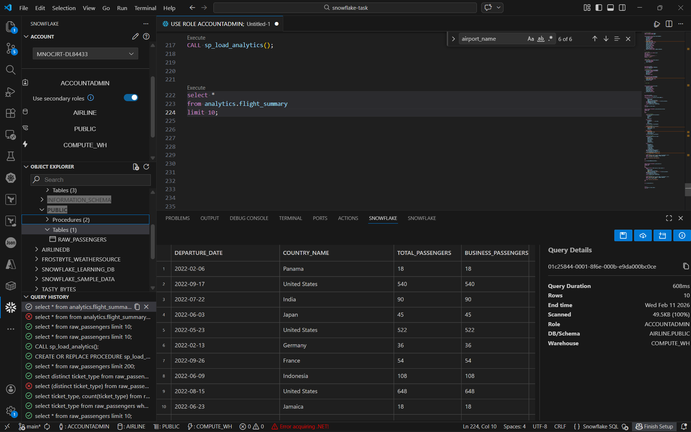
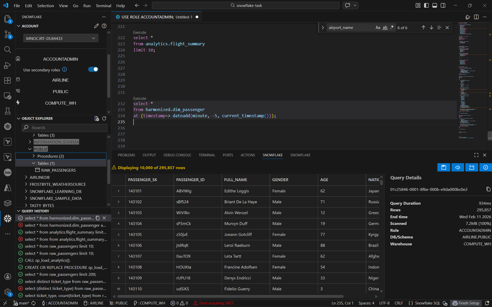
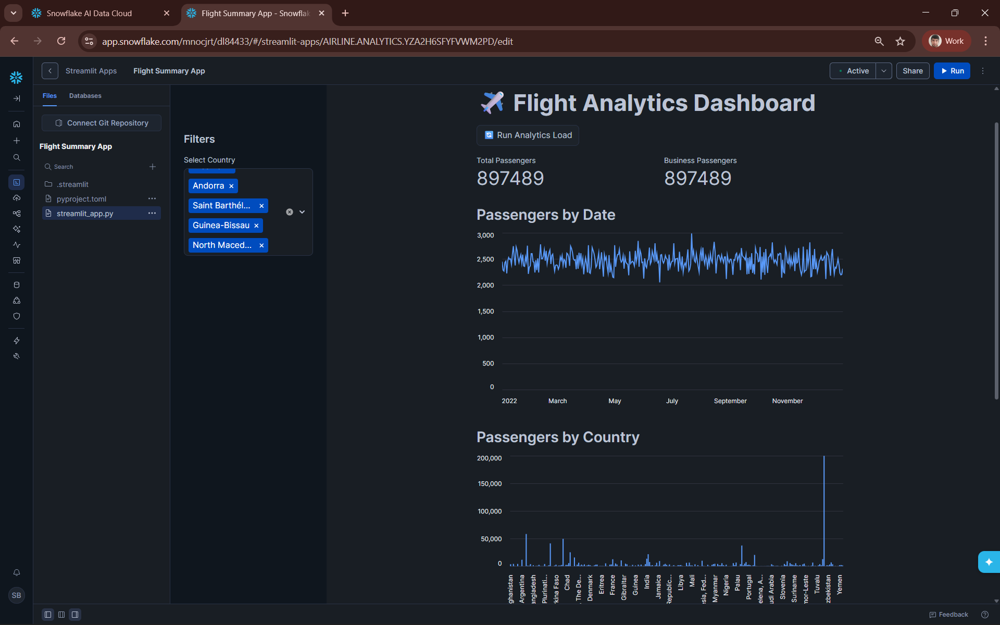

# Airline Data Warehouse Project
## Project Overview

This project implements an end-to -end **DWH** solutions using **Snowflake** and a **Streamlit** dashboard for visualization.
The system integrates passenger flight data from CSV files, process it through a multi-layer warehouse architecture (Raw -> Harmonized -> Analytics), applies security and governance.

## Airflow orcherstration
Running Airflow on docker

Here in localhost:8080 we can see that our dags

We can see that our data is loaded below

## Time travel & flight summary
A glimpse of flight summary and using time-travel feature of Snowflake, we are getting data from 5 minutes ago

## Graphic 
# ✈️ Flight Analytics Dashboard

A Streamlit-based analytics dashboard connected to Snowflake that provides interactive insights into flight passenger data.

## 🚀 Features

- Connects directly to **Snowflake** using Streamlit's native connection
- Executes a stored procedure (`sp_load_analytics`) to refresh analytics data
- Displays key performance indicators (KPIs):
  - Total Passengers
  - Business Passengers
- Interactive filters by **Country**
- Visualizations:
  - 📈 Line chart of passengers by departure date
  - 📊 Bar chart of passengers by country

